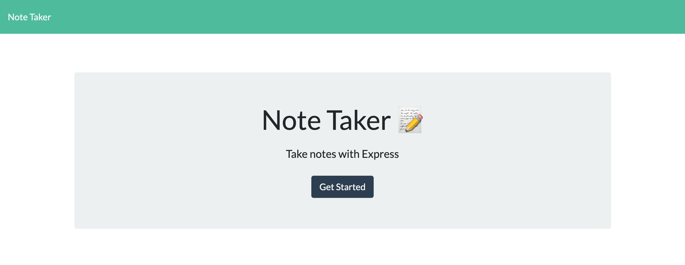
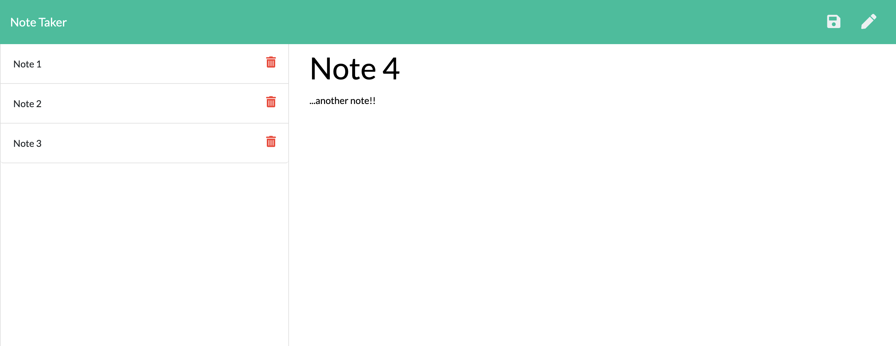
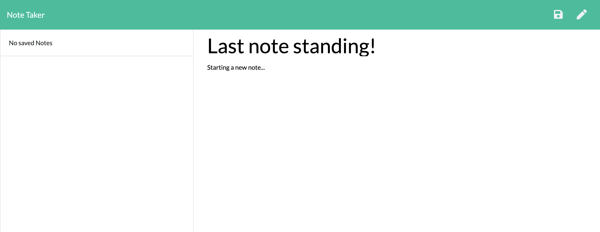

# Express.js Note Taker

## Table of Contents
- [Description](#description)
- [Installation](#installation)
- [Instructions](#instructions)
- [Credits](#credits)
- [Contributions](#contributions)
- [Tests](#tests)
- [Questions](#questions)
- [License](#license)
---
## Screenshots of deployed app:
(https://peaceful-brook-44834.herokuapp.com/)
### Homepage

### Add new notes with ease!

### Delete old notes too!


## Description:
```
The purpose of this application is to allow the user to create notes, 
that can be saved and organised by their titles. A simple, intuitive 
interface is complimented by clever backend code that manages storage 
and retrieves the notes on load.
```
---

## Installation:
```
node.js and express.js 
```
---
## Instructions:
```
Click get started to view the note taking screen, click on the pen
in the top-right corner to begin a new note. Enter a title and some
text and hit save.
```
---
## Credits:
```
This work is my own.
```
---
## Contributions:
```
Please feel free to fork the repo.
```
---
## Tests:
```
None
```
---
## Questions:  
```
If you have any questions please reach out to me on Git:  

* MJ-0001
```

---
## License:  
```
MIT  
```

  

https://opensource.org/licenses/MIT

---